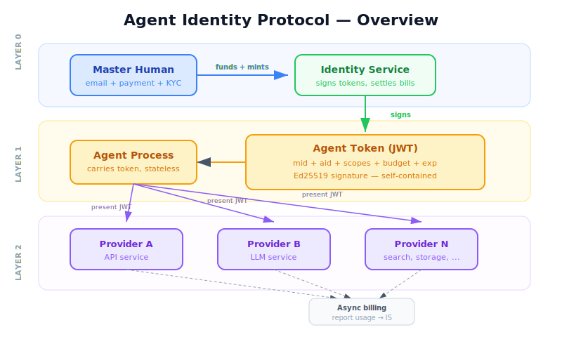
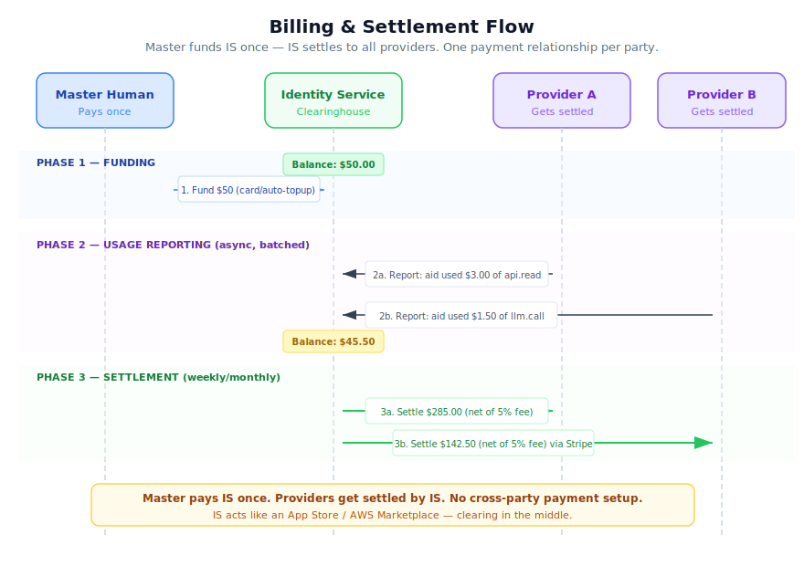

# Agent Identity Protocol (AIP)

**A protocol for agent authentication, authorization, accountability, and payment.**

> Cookies and login forms gave the web a standard way to authenticate and authorize. Agents need the same — plus built-in payment.

## Problem

The biggest hurdle for long-horizon agents is that they keep hitting setup walls for external APIs and services. Every new API requires account creation, subscription management, and API key provisioning — all designed for humans clicking through web forms. Agents can't open accounts for themselves, can't manage subscriptions, and can't provision their own credentials.

Today's auth systems assume a human is present: OAuth flows pop up browser windows, API dashboards require manual key rotation, and billing is scattered across dozens of individual provider accounts. None of this works when your agent needs to autonomously call 10 different APIs over a 6-hour task.

**We need an agent-era auth system** — one where a human sets up identity and payment once, and agents can immediately access any compatible service without per-provider onboarding.

## Goals

1. **Zero per-provider onboarding** — Agents can access any compatible service immediately by presenting their token. No per-provider account creation, API key provisioning, or registration required.
2. **Agent auth** — A standard authentication mechanism that agents can use autonomously across any compatible service
3. **Payment (fiat first)** — Built-in billing and settlement using fiat currency, so agents can consume paid services without per-provider payment setup
4. **Security of agent access to services and payment** — Humans retain control over what agents can access and spend, with revocation, budgets, and audit trails

## Non-Goals

1. **Per-transaction settlement** — The protocol settles in batches (weekly/monthly), not on every individual request. Real-time per-transaction payment adds unnecessary complexity and latency.

## Terminology

- **Master Identity** — A human-owned account bound to email + payment method. The accountability root. Never travels with agents.
- **Identity Service** — The trusted authority that signs agent tokens, maintains revocation lists, and settles billing between parties.
- **Agent Token** — A signed, expiring JWT credential carried by an agent. Self-contained — verifiable offline by any provider holding the public key.
- **Resource Provider** — Any API or service that accepts AIP agent tokens for authentication and billing.
- **Facilitator** — (Future) A lightweight intermediary that can verify and settle on behalf of the Identity Service.

## Principles

- **One identity, one payment** — Human sets up once. Every agent and every service bills through that single relationship.
- **Offline-first verification** — Providers verify tokens locally using cached public keys. No per-request call to the Identity Service.
- **Human retains control** — Budgets, expiry, and instant revocation. The human can kill any agent at any time.
- **Fiat first** — Real-world services want USD. Crypto support can come later, but the default path is fiat.
- **Stateless agents** — Agents carry a token and present it. They never manage credentials, payment info, or accounts.

## Core Idea

A **master identity** (human + billing) is the accountability root. Agents carry **delegated capability tokens** — signed, expiring credentials derived from the master identity. Resource providers verify tokens offline using the identity service's public key.

```
Human (Master Identity)
  └─ Identity Service (trust anchor, signs tokens, settles bills)
       └─ Agent Token (expiring, self-contained)
            └─ Resource Provider (verifies offline, bills asynchronously)
```

## Architecture



## Identity Layers

| Layer | What | Role |
|-------|------|------|
| **Layer 0** | Master Identity | Human accountability root (email + payment + optional KYC). Never travels. |
| **Layer 1** | Agent Token | Signed, expiring credential. This is what agents carry and present. |
| **Layer 2** | Resource Access | Providers verify tokens and serve requests. Billing flows back to master. |

## Protocol Flow

```
1. MINT    — Human requests token from identity service with TTL + budget
2. ACCESS  — Agent presents token to resource provider (offline verification)
3. BILLING — Resource provider reports usage against master identity
4. REVOKE  — Human revokes token; propagates via revocation list
```

## Token Format

AIP tokens use **JWT with EdDSA (Ed25519)** signatures — compact, fast, no algorithm confusion attacks, with broad library support via RFC 8037.

```json
{
  "mid": "master_id_abc123",
  "aid": "agt_7f3k9m",
  "iat": 1710000000,
  "exp": 1710007200,
  "budget": { "usd": 5.00 },
  "bind_ip": null,
  "bind_task": "task_xyz"
}
```

Signed with Ed25519 by the identity service. Verified offline by any resource provider holding the public key.

## Flow Diagrams

| Flow | Description |
|------|-------------|
|  | **[Token Mint](diagrams/01-mint-flow.svg)** — Human requests a token from the Identity Service |
|  | **[Access](diagrams/02-access-flow.svg)** — Agent presents token, provider verifies offline |
|  | **[Billing & Settlement](diagrams/03-billing-settlement-flow.svg)** — Master funds the Identity Service, Identity Service settles to providers |
|  | **[Revocation](diagrams/04-revocation-flow.svg)** — Human kills agent, revocation propagates |

## RFCs

- **[Protocol Design](rfcs/protocol-design.md)** — Full design rationale, architecture, and trade-offs
- **[AIP-001: Core Protocol](rfcs/aip-001-core.md)** — Formal protocol specification
- **[AIP-002: Token Specification](rfcs/aip-002-token.md)** — Token format, signing, and verification
- **[AIP-003: Billing & Settlement](rfcs/aip-003-billing.md)** — Credit system, usage reporting, provider settlement
- **[Integration Guide](rfcs/integration-guide.md)** — How resource providers join the ecosystem

## Reference Implementation

See [`src/`](src/) for a TypeScript reference implementation covering token minting, verification, and revocation checking.

## Key Design Decisions

- **Ed25519 over RSA** — Smaller keys (32B vs 256B+), smaller signatures (64B vs 256B+), faster operations, no algorithm confusion
- **JWT envelope** — Standard tooling ecosystem via RFC 8037 EdDSA support
- **Hybrid revocation** — Short TTL tokens (15-60 min) + periodic revocation list polling. Balances offline verification speed with revocation freshness
- **Agent delegation chains** — Agents can mint sub-agent tokens with shorter TTL, like X.509 intermediate certs

## What This Enables

- Agent spawned -> immediately has credentials -> hits any AIP-compatible API
- No login, no OAuth dance, no per-service API key management
- All spend rolls up to one master billing identity
- Human can kill any agent instantly via revocation
- Full audit trail: every access is attributable to a specific agent, traceable to a human
- Agents are stateless with respect to auth — token is self-contained

## License

MIT
