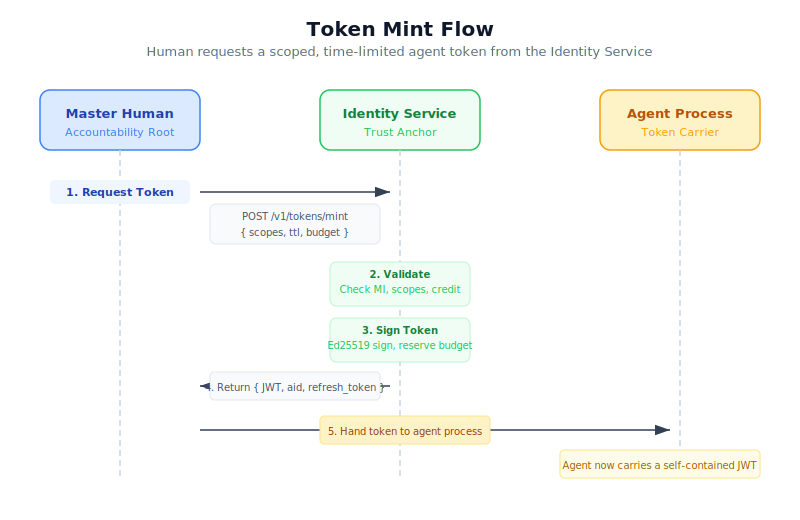
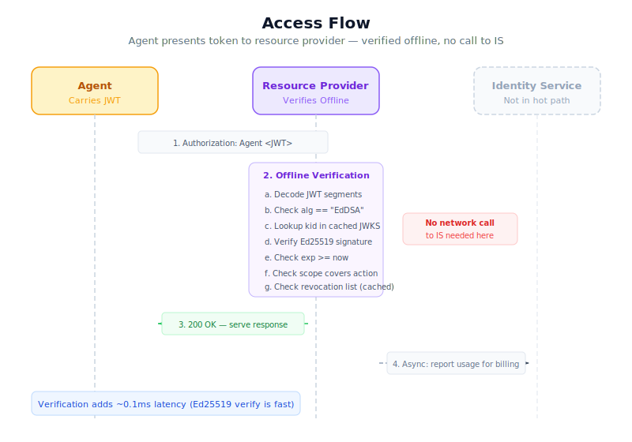
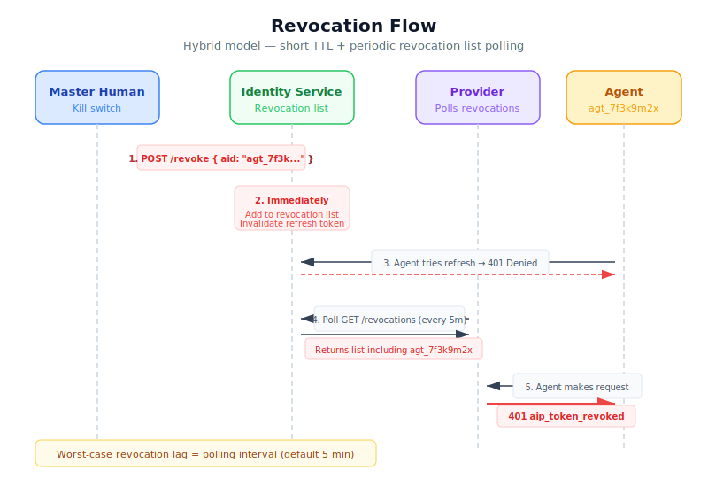

# Agent Identity Protocol (AIP)

**A protocol for agent authentication, authorization, and accountability.**

AIP solves the fundamental problem of how AI agents prove who they are, what they're allowed to do, and who pays for it — without interactive authentication flows, per-service API keys, or exposing master credentials.

## Core Idea

A **master identity** (human + billing) is the accountability root. Agents carry **delegated capability tokens** — signed, scoped, expiring credentials derived from the master identity. Resource providers verify tokens offline using the identity service's public key.

```
Human (Master Identity)
  └─ Identity Service (trust anchor, signs tokens, settles bills)
       └─ Agent Token (scoped, expiring, self-contained)
            └─ Resource Provider (verifies offline, bills asynchronously)
```

## Architecture


## Identity Layers

| Layer | What | Role |
|-------|------|------|
| **Layer 0** | Master Identity | Human accountability root (email + payment + optional KYC). Never travels. |
| **Layer 1** | Agent Token | Signed, scoped credential. This is what agents carry and present. |
| **Layer 2** | Resource Access | Providers verify tokens and serve requests. Billing flows back to master. |

## Protocol Flow

```
1. MINT    — Human requests token from identity service with scopes + TTL + budget
2. ACCESS  — Agent presents token to resource provider (offline verification)
3. BILLING — Resource provider reports usage against master identity
4. REVOKE  — Human revokes token; propagates via revocation list
```

## Token Format

AIP tokens use **JWT with EdDSA (Ed25519)** signatures — compact, fast, no algorithm confusion attacks, with broad library support via RFC 8037.

```json
{
  "mid": "master_id_abc123",
  "aid": "agt_7f3k9m",
  "iat": 1710000000,
  "exp": 1710007200,
  "scopes": ["web.read", "search.*", "llm.call"],
  "budget": { "usd": 5.00 },
  "bind_ip": null,
  "bind_task": "task_xyz"
}
```

Signed with Ed25519 by the identity service. Verified offline by any resource provider holding the public key.

## Flow Diagrams

| Flow | Description |
|------|-------------|
|  | **[Token Mint](docs/diagrams/01-mint-flow.svg)** — Human requests a scoped token from IS |
|  | **[Access](docs/diagrams/02-access-flow.svg)** — Agent presents token, provider verifies offline |
|  | **[Billing & Settlement](docs/diagrams/03-billing-settlement-flow.svg)** — Master funds IS, IS settles to providers |
|  | **[Revocation](docs/diagrams/04-revocation-flow.svg)** — Human kills agent, revocation propagates |

## Documentation

- **[Protocol Design](docs/protocol-design.md)** — Full design rationale, architecture, and trade-offs
- **[AIP-001: Core Protocol](spec/aip-001-core.md)** — Formal protocol specification
- **[AIP-002: Token Specification](spec/aip-002-token.md)** — Token format, signing, and verification
- **[AIP-003: Billing & Settlement](spec/aip-003-billing.md)** — Credit system, usage reporting, provider settlement
- **[Integration Guide](docs/integration-guide.md)** — How resource providers join the ecosystem

## Reference Implementation

See [`src/`](src/) for a TypeScript reference implementation covering token minting, verification, and revocation checking.

## Key Design Decisions

- **Ed25519 over RSA** — Smaller keys (32B vs 256B+), smaller signatures (64B vs 256B+), faster operations, no algorithm confusion
- **JWT envelope** — Standard tooling ecosystem via RFC 8037 EdDSA support
- **Hybrid revocation** — Short TTL tokens (15-60 min) + periodic revocation list polling. Balances offline verification speed with revocation freshness
- **Hierarchical scopes** — `web.*`, `web.read`, `web.read.public` — additive only, never subtractive
- **Agent delegation chains** — Agents can mint sub-agent tokens with subset scopes and shorter TTL, like X.509 intermediate certs

## What This Enables

- Agent spawned -> immediately has credentials -> hits any AIP-compatible API
- No login, no OAuth dance, no per-service API key management
- All spend rolls up to one master billing identity
- Human can kill any agent instantly via revocation
- Full audit trail: every access is attributable to a specific agent, traceable to a human
- Agents are stateless with respect to auth — token is self-contained

## License

MIT
